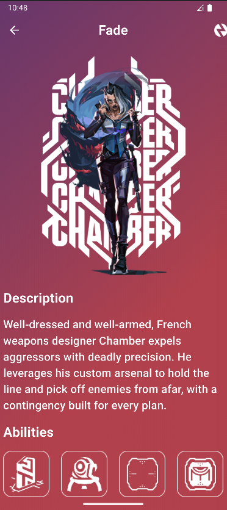
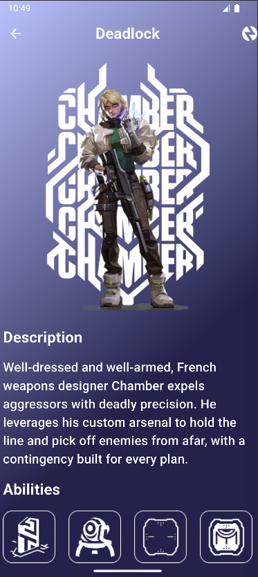

🎮 Valorant Agents App

A beautiful Flutter application that lets users explore Valorant agents with smooth animations, gradient UI cards, hero transitions, and detailed agent info screens.

✨ Features
🔥 1. Stunning Home Screen

The home screen lists Valorant agents in a clean grid layout with:
✔️ Gradient-colored agent cards
✔️ Hero animations for smooth transitions
✔️ Responsive design (adapts to all screen sizes)

🎭 2. Agent Card (PlayerWidget)

Each agent card includes:

🌈 Dual-color gradient background

🖼️ High-quality agent image using Hero animations

📝 Agent name with beautiful typography

👉 Clickable cards that navigate to the details screen

📄 3. Agent Details Screen

The agent details page displays everything about the chosen agent:

🖼️ Full-screen hero animation of the agent

📘 Agent description

⭐ List of abilities with custom icons

🎨 Fully theme-matching gradient background

🔙 Beautiful transparent AppBar with back navigation

🧩 Reusable components (PlayerWidget)

🎨 4. Beautiful Gradients & Custom Theme

The app uses a custom set of colors (AppColors) to maintain:

Consistent UI

Smooth color transitions

Vivid Valorant-inspired theme

⚡ 5. Smooth Navigation

Navigator.pushReplacementNamed() for clean navigation

Named routes for better code management

Hero tags for image + text transitions

---

## 📸 Screenshots

| Login Screen | Signup Screen | Home Feed |
|---------------|----------------|------------|
|  |  |  |

---

🛠️ Technologies Used

Flutter (Dart)

Material Design UI

Hero Animations

Responsive Layouts

Custom UI Components

---
## ⚙️ Getting Started
```bash
git clone https://github.com/OmarDiab2002/valorant.git
cd facebook
flutter pub get
flutter run
